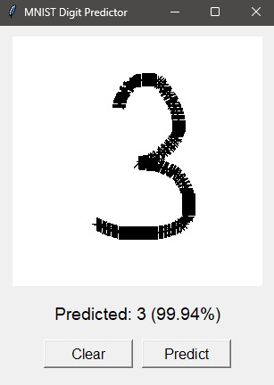
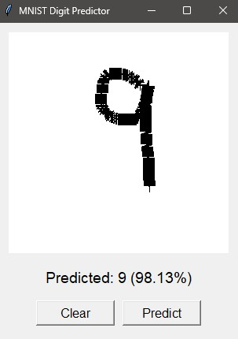

# ✍️ Handwritten Digit Recognition using PyTorch and Tkinter

A simple project to recognize handwritten digits drawn by the user using a PyTorch model and a Tkinter GUI.

---

## Example Prediction:


---

## 🚀 Features

* **MNIST Dataset Training:** Trains a simple neural network on the MNIST dataset.
* **Interactive Drawing:** Users can draw digits on a canvas.
* **Real-time Prediction:** Predicts the drawn digit using the trained model.
* **Confidence Score:** Shows how confident the model is in its prediction.
* **Processed Image View:** Displays the preprocessed image sent to the model.

---

## 📦 Requirements

To run this project, you'll need:

* Python 3.x
* PyTorch (`torch`, `torchvision`)
* Pillow (`PIL`)
* Tkinter (usually comes with Python)

Install the necessary libraries using pip:

```bash
pip install torch torchvision torchaudio --index-url https://download.pytorch.org/whl/cpu
pip install Pillow
```

---

## 🛠️ Installation

1.  Clone the repository:

    ```bash
    git clone https://github.com/SakshamVats/pytorch-mnist-net/
    cd pytorch-mnist-net
    ```

2.  (Optional) Create a virtual environment:

    ```bash
    python -m venv venv
    source venv/bin/activate  # Linux/macOS
    venv\Scripts\activate  # Windows
    ```

3.  Install dependencies:

    ```bash
    pip install -r requirements.txt  # If you have a requirements.txt
    # Or install directly as mentioned in Requirements
    ```

---

## 🧠 How to Use

### 1. Train the Model (Optional)

To train the model (if you don't want to use the pre-trained one):

```bash
python MNIST/mnist.py
```

### 2. Run the Digit Predictor

Execute the GUI script:

```bash
python draw_predict.py
```

Draw a digit on the white canvas and click "Predict" to see the result. Use "Show Processed" to view the image the model uses. "Clear" will erase your drawing.

---

## 🗂️ Project Structure

```
pytorch-mnist-net/
├── MNIST/
│   ├── data/               # MNIST dataset
│   ├── mnist.py            # Training script
│   └── mnist_model_best.pth  # Trained model weights
├── draw_predict.py       # GUI and prediction script
├── README.md             # This file
└── requirements.txt        # (Optional) Dependencies list
```

---

## ⚙️ Model

A simple feedforward neural network with three fully connected layers is used for classification.

---

## 🤝 Contributing

Pull requests are welcome! If you have any ideas or find issues, please open an issue or submit a PR.

---

## 🙌 Acknowledgements

Thanks to:

* The creators of the MNIST dataset.
* The PyTorch team for the amazing deep learning framework.
* The Tkinter developers for the GUI library.
